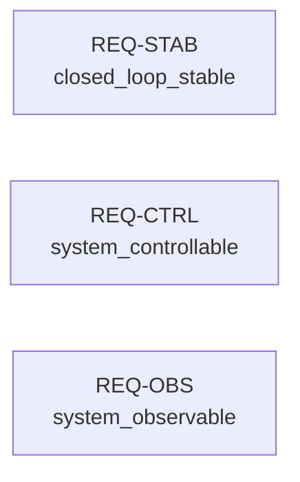
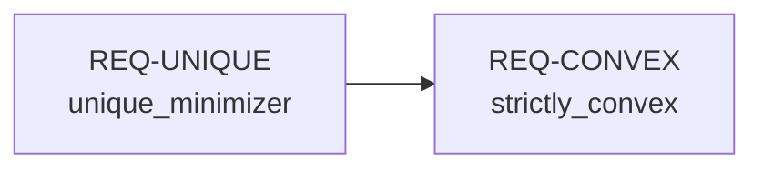

# Frame proof problems

You are helping a **domain expert** who knows WHAT they want to prove but isn't going to construct the proofs themselves. Your job is to translate their domain knowledge into well-formed symproof problems.

**You produce problem statements. You do NOT produce proofs.**

## Key principle: one hypothesis per property, not one proof for everything

A real system needs many properties verified. Frame them as SEPARATE hypotheses:

```
System: satellite attitude controller
├── REQ-STAB: closed-loop stability (Routh-Hurwitz)     → hypothesis_stability
├── REQ-CTRL: controllability (rank condition)           → hypothesis_controllable
├── REQ-OBS:  observability (rank condition)             → hypothesis_observable
├── REQ-LYAP: Lyapunov stability (P exists and is PD)   → hypothesis_lyapunov
└── REQ-PERF: pointing error < 0.1 deg (steady-state)   → hypothesis_pointing
```

Each hypothesis gets its own proof and its own sealed hash. The hashes go into a requirements traceability matrix. A reviewer can verify any single proof without understanding the others.

**Do NOT combine unrelated properties into one hypothesis.** `And(stable, controllable, observable)` is a monolith that's harder to prove, harder to review, and harder to maintain. If stability breaks after a parameter change, you shouldn't have to re-prove controllability.

Use `import_bundle` ONLY when there is a genuine logical dependency (e.g., uniqueness of optimum depends on strict convexity).

## Argument

The user's proof request: $ARGUMENTS

## Workflow

### Step 1: Understand the system

Ask the user:
- **What system are you working with?** (plant, mechanism, model, algorithm)
- **What are you trying to establish?** Not one thing — enumerate the properties they need
- **What requirements document or standard are they tracing to?** (DO-178C, ERC-4626, ISO 26262, internal spec)

### Step 2: Enumerate the properties

For each property the system needs, create a separate entry:
- Requirement ID (or name)
- Plain English statement
- Which symbols are involved
- Whether it depends on another property (→ import_bundle) or is independent

Most properties should be independent. The traceability comes from the hash mapping, not from proof composition.

### Step 3: Define symbols

Declare SymPy symbols with appropriate assumptions. These are shared across all hypotheses for this system.

```python
import sympy

Kp = sympy.Symbol("Kp", positive=True)   # proportional gain [N·m/rad]
Kd = sympy.Symbol("Kd", positive=True)   # derivative gain [N·m·s/rad]
J = sympy.Symbol("J", positive=True)      # moment of inertia [kg·m²]
```

Always include physical units in comments and SymPy assumptions matching domain constraints.

### Step 4: Build the axiom set

Axioms are shared — they define the system context that all hypotheses operate within.

```python
from symproof import Axiom, AxiomSet

axioms = AxiomSet(
    name="satellite_adcs",
    axioms=(
        Axiom(name="inertia_positive", expr=J > 0),
        Axiom(name="proportional_gain_positive", expr=Kp > 0),
        Axiom(name="derivative_gain_positive", expr=Kd > 0),
    ),
)
```

Rules:
- Don't include things that need to be PROVEN as axioms
- Separate compound constraints: `f > 0` and `f < 1`, not `And(f > 0, f < 1)`
- Each axiom gets a descriptive name

### Step 5: State each hypothesis independently

```python
h_stability = axioms.hypothesis(
    "closed_loop_stable",
    expr=...,
    description="All characteristic polynomial roots have negative real part",
)

h_controllable = axioms.hypothesis(
    "system_controllable",
    expr=...,
    description="Controllability matrix has full rank",
)

# These are INDEPENDENT — they share axioms but get separate proofs
```

### Step 6: Document the traceability map

```python
# Requirements traceability (proof hashes filled in after construction)
#
# REQ-STAB → hypothesis: closed_loop_stable       → proof hash: TBD
# REQ-CTRL → hypothesis: system_controllable       → proof hash: TBD
# REQ-OBS  → hypothesis: system_observable         → proof hash: TBD
#
# Dependencies:
#   REQ-STAB depends on: (none — independent)
#   REQ-CTRL depends on: (none — independent)
#   REQ-OBS  depends on: (none — independent)
#
# Simulation & test coverage needed for:
#   - Robustness to ±20% inertia uncertainty (Monte Carlo)
#   - Discrete-time stability (Tustin transform analysis)
#   - Actuator saturation behavior (HIL test)
```

**Visualize the planned structure** as a Mermaid diagram so the domain expert and the proof constructor see the same picture. For independent properties:



For properties with logical dependencies (e.g., uniqueness depends on strict convexity):



Show this diagram to the domain expert before handing off to the constructor. It makes the independence vs. dependency structure visible and prevents the constructor from accidentally coupling proofs that should be independent.

### Step 7: Save the framed problem

Write a Python file containing:
1. Symbol declarations with units
2. AxiomSet (shared)
3. Each hypothesis (independent)
4. Traceability map (as comments)
5. Scope documentation (what's NOT covered, what needs simulation/testing)

The file should be importable: `from framed_satellite import axioms, h_stability, h_controllable`

## What you do NOT do

- Do NOT construct lemmas or call ProofBuilder
- Do NOT call seal()
- Do NOT combine independent properties into one hypothesis
- Do NOT import from symproof.library (that's the prover's job)
